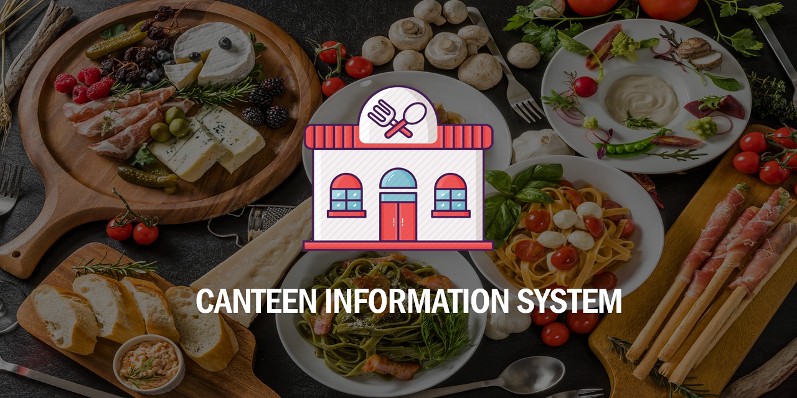
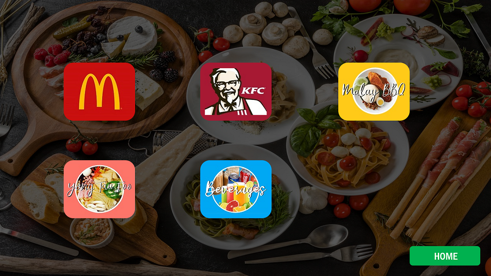
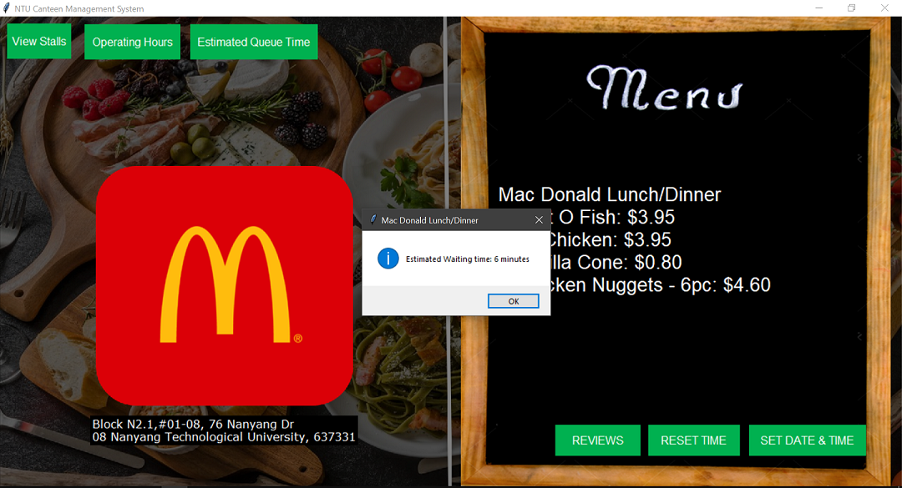

# Canteen Information System



A real-time canteen information software that can store and display all the information of stalls in the NTU North Spine Canteen. It can:  
+ Store and display stall information
+ Store and display stall menus
+ Display stall information and menus based on current system date and time
+ Display stall information and menus based on user defined date and time
+ Calculate estimated waiting time for the stall by asking the user to enter the number of people in the queue
+ Allow to check the operating hours for all the stalls

## Overview

  
The homescreen displays the current date and time. It allows the user to view all the stalls, set their preferred date and time or find out how to use the application.  


  
Users can view all the stalls that are available in the application in the "All Stalls" page.  


  
Users can view all the menu items of a particular stall according to either the set date/time or the current system date/time. They can also add a review of a specific stall.  


  
The application will show the waiting time for a particular stall based on the number of people waiting in queue.  


  
The user can check the menus of stalls based on their preferred date and time. They will be prompted to set it through a calendar.  

## Getting started
### Prerequisites

You will need the following to run the program:
+ Python 3
+ Pillow
+ TKCalendar
+ Pygame

### Installing and running

Install the required modules by running the following commands in your terminal:
```
pip install pillow
pip install tkcalendar
pip install pygame
```
Then clone this repo with:
```
git clone https://github.com/mohamedirfansh/Canteen-Information-System.git
```
Finally, run ```main.py```.

## Built with

+ [Python 3](https://www.python.org/) - The main language used to develop the application.
+ [Tkinter](https://docs.python.org/3/library/tkinter.html) - The main module used to develop the GUI for the application.
+ [Pygame](https://www.pygame.org/docs/) - Used to play the music in the application.
+ [TKCalendar](https://pypi.org/project/tkcalendar/) - Used for the user to enter their preferred date and time.

## Developers

+ [Mohamed Irfan](https://github.com/mohamedirfansh)
+ Muhammad Zufiqqar
+ Berlynn

## License

[](https://github.com/mohamedirfansh/Canteen-Information-System/blob/master/LICENSE)

This project is licensed under the **[MIT License](http://opensource.org/licenses/mit-license.php)** - see the [LICENSE](https://github.com/mohamedirfansh/Canteen-Information-System/blob/master/LICENSE) file for more details.  

